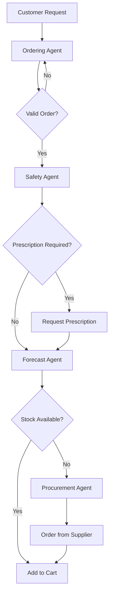

# Mediloon AI-Driven Agentic Pharmacy System

## 🎯 Overview

An intelligent, autonomous pharmacy ordering system that uses AI agents to manage medicine ordering, predict refills, and automate procurement workflows. Features voice/text ordering, predictive analytics, and multi-agent automation.

## ✨ Key Features

### 1. Voice/Text Ordering Assistant
- 🎤 Natural language ordering via voice or text
- 🌍 Multi-language support (English, German, Arabic)
- 🧠 Intelligent medicine name parsing
- 💬 Multi-turn conversation capability
- ✅ Prescription validation
- 🛒 Automatic cart creation

### 2. Predictive Ordering Engine
- 📊 Learns from customer order history
- 🔮 Predicts medicine depletion dates
- 🔔 Auto-suggests refills via notifications
- 📈 Visual prediction timelines
- 🎯 Personalized refill recommendations

### 3. Multi-Agent System (LangChain/LangGraph)
- **Ordering Agent**: Assists customers during ordering
- **Forecast Agent**: Predicts refill and stock needs
- **Procurement Agent**: Automates purchase orders
- **Safety Agent**: Validates prescriptions and checks interactions

### 4. Workflow Automation (MCP Integration)
- 📧 Email/SMS/WhatsApp notifications via Zapier
- 🔄 Distributor API calls via n8n
- 🔗 Webhook integration with CMS
- ⚡ Real-time inventory updates

## 🏗️ Architecture

```
mediloon-pharmacy/
├── client/                # React frontend (JavaScript/JSX)
│   ├── src/
│   │   ├── pages/        # Page components
│   │   ├── context/      # React contexts
│   │   └── App.jsx       # Main app
│   └── public/           # Static assets
├── server/               # Node.js Express backend
│   ├── controllers/     # Request handlers
│   ├── routes/          # API routes
│   ├── models/          # Database models
│   ├── middleware/      # Auth, validation
│   └── sockets/         # Real-time handlers
├── ai-backend/          # Python FastAPI AI server
│   ├── agents/          # LangChain agents
│   ├── api/             # REST API endpoints
│   ├── models/          # Database models
│   └── core/            # AI logic
```

## 🚀 Tech Stack

### Frontend (Client)
- **Framework**: React 18 (Create React App)
- **Language**: JavaScript (JSX)
- **Styling**: CSS + inline styles
- **UI Components**: Custom components
- **Voice**: Web Speech API + Whisper
- **State**: React Context
- **Real-time**: Socket.io client
- **Routing**: React Router v6

### Backend (Server)
- **Framework**: Node.js Express
- **Language**: JavaScript
- **Database**: MongoDB (Mongoose)
- **Cache**: Redis
- **Authentication**: JWT + bcrypt
- **Real-time**: Socket.io server
- **Validation**: express-validator

### AI Backend
- **Framework**: FastAPI (Python 3.11+)
- **AI/ML**: LangChain, LangGraph, OpenAI GPT-4
- **Database**: MongoDB (Motor async driver)
- **Cache**: Redis
- **Voice**: OpenAI Whisper

## 📦 Installation

### Prerequisites
- Node.js 18+ and npm
- Python 3.11+
- MongoDB 6.0+ (running locally or MongoDB Atlas)
- Redis 7.0+ (running locally)

### 1. Setup Databases

Install and start MongoDB and Redis locally:

**MongoDB:**
- Download from https://www.mongodb.com/try/download/community
- Start: `mongod --dbpath <your-data-path>`

**Redis:**
- Download from https://redis.io/download
- Start: `redis-server`

### 2. Backend Setup (AI FastAPI)

```bash
cd ai-backend

# Activate virtual environment
venv\Scripts\activate  # Windows
# or: source venv/bin/activate  # Mac/Linux

# Install dependencies
pip install -r requirements.txt

# Set environment variables
copy .env.example .env  # Windows
# or: cp .env.example .env  # Mac/Linux
# Edit .env with your OpenAI API key

# Start server
python main.py
```

**Runs on:** http://localhost:8000

### 3. Server Setup (Node.js Express)

```bash
cd server

# Install dependencies
npm install

# Set environment variables
copy .env.example .env  # Windows
# or: cp .env.example .env  # Mac/Linux
# Edit .env with your JWT_SECRET and database URLs

# Start server
npm run dev
```

**Runs on:** http://localhost:3000

### 4. Client Setup (React)

```bash
cd client

# Install dependencies
npm install

# Set environment variables
copy .env.example .env  # Windows
# or: cp .env.example .env  # Mac/Linux

# Start development server
npm start
```

**Runs on:** http://localhost:3001

### 5. Access Application

- **Customer Interface**: http://localhost:3001
- **API Server**: http://localhost:3000
- **AI Backend API**: http://localhost:8000/docs
- **Health Checks**: 
  - Express: http://localhost:3000/health
  - FastAPI: http://localhost:8000/health

## 🔑 Environment Variables

### AI Backend (.env)
```env
# Database
MONGODB_URI=mongodb://localhost:27017/mediloon
REDIS_URL=redis://localhost:6379

# AI/ML
OPENAI_API_KEY=your_openai_api_key

# Security
JWT_SECRET=your_jwt_secret_key
```

### Server (.env)
```env
NODE_ENV=development
PORT=3000
MONGODB_URI=mongodb://localhost:27017/mediloon
REDIS_URL=redis://localhost:6379
JWT_SECRET=your_jwt_secret_key
FASTAPI_URL=http://localhost:8000
FASTAPI_API_KEY=your_internal_api_key
CORS_ORIGIN=http://localhost:3001
```

### Client (.env)
```env
REACT_APP_API_URL=http://localhost:3000
REACT_APP_SOCKET_URL=http://localhost:3000
```

## 🎮 Usage

### Customer Ordering

1. **Voice Ordering**
   - Click the microphone button
   - Say: "I need 30 tablets of Aspirin 100mg"
   - Confirm the parsed order
   - Complete checkout

2. **Text Ordering**
   - Type in the chat: "I need metformin 500mg"
   - The AI assistant will guide you through options
   - Add to cart and checkout

3. **Predictive Refills**
   - View your medicine timeline
   - Get automatic refill notifications
   - One-click reorder

### Admin Operations

1. **Inventory Management**
   - Monitor stock levels
   - View predictive alerts
   - Approve auto-procurement

2. **Agent Monitoring**
   - View agent activity logs
   - Monitor conversation quality
   - Review safety alerts

3. **Analytics**
   - Order patterns
   - Prediction accuracy
   - Customer satisfaction

## 🤖 Multi-Agent System

### Agent Workflow



### Agent Descriptions

**Ordering Agent**
- Handles natural language conversations
- Parses medicine names and quantities
- Manages multi-turn dialogues
- Confirms alternatives and variants

**Forecast Agent**
- Analyzes order history
- Predicts depletion dates
- Calculates refill timelines
- Triggers proactive notifications

**Procurement Agent**
- Monitors inventory levels
- Creates purchase orders automatically
- Integrates with supplier APIs via n8n
- Optimizes order quantities

**Safety Agent**
- Validates prescription requirements
- Checks drug interactions
- Verifies dosage appropriateness
- Flags potential safety issues

## 🔧 API Endpoints

### Express Server (Port 3000)

#### Authentication
```
POST   /api/auth/register       Register new user
POST   /api/auth/login          Login user
POST   /api/auth/logout         Logout user
POST   /api/auth/refresh        Refresh token
GET    /api/auth/me             Get current user
PATCH  /api/auth/profile        Update profile
```

#### Orders
```
GET    /api/orders              Get user orders
GET    /api/orders/:id          Get order by ID
POST   /api/orders/process      Process order (proxy to AI)
```

#### Medicines
```
GET    /api/medicines           List medicines
GET    /api/medicines/:id       Get medicine details
```

### FastAPI AI Backend (Port 8000)

#### AI Ordering
```
POST   /api/v1/orders/text      Process text order
POST   /api/v1/orders/voice     Process voice order
POST   /api/v1/orders/confirm   Confirm order
GET    /api/v1/orders/user/:id  Get user orders
```

#### Predictions
```
GET    /api/v1/predictions/user/:id   Get user predictions
GET    /api/v1/medicines              List medicines
```

## 🧪 Testing

```bash
# Backend tests
cd backend
pyServer tests
cd server
npm test

# AI Backend tests
cd ai-backend
pytest tests/ -v --cov

# Client tests
cd client
Docker deployment will be added in future updates. For now, follow manual deployment:

1. Set up MongoDB and Redis on your server
2. Deploy AI Backend (FastAPI) - see [ai-backend/README.md](ai-backend/README.md)
3. Deploy Server (Express) - see [server/README.md](server/README.md)
4. Build and deploy Client (React) - see [client/README.md](client/README.md)

Configure environment variables for production and use a process manager like PM2 for Node.js service
### Manual Deployment

See [DEPLOYMENT.md](./DEPLOYMENT.md) for detailed deployment instructions.

## 📊 Monitoring

- **Express Health**: `GET http://localhost:3000/health`
- **FastAPI Health**: `GET http://localhost:8000/health`
- **Socket.io Status**: Check browser console for connection status

## 🔒 Security

- JWT-based authentication with bcrypt password hashing
- Role-based access control (RBAC)
- Socket.io authentication via JWT
- Express rate limiting
- Input validation with express-validator
- CORS configuration
- Environment variable protection

## 🌍 Multi-Language Support

Supported languages:
- 🇬🇧 English
- 🇩🇪 German (Deutsch)
- 🇸🇦 Arabic (العربية)

## 📝 License

MIT License

## 🆘 Support

- **Issues**: Create an issue on GitHub
- **Documentation**: See individual README files in server/, client/, ai-backend/

## 🎯 Roadmap

- ✅ Voice/text ordering with AI
- ✅ Multi-agent system (LangChain)
- ✅ Real-time updates via Socket.io
- ✅ JWT authentication
- ✅ React frontend with routing
- 🔄 Complete AI integration (frontend → AI backend)
- 🔄 Voice recording and Whisper integration
- 🔄 Admin dashboard
- 🔄 Analytics and reporting
- 🔄 Docker containerization
- 🔄 Production deployment

---

**Built with ❤️ for HackFusion Hackathon**

- [ ] Mobile app (React Native)
- [ ] Voice assistant integration (Alexa, Google Home)
- [ ] Blockchain for prescription verification
- [ ] AR medicine scanner
- [ ] Telemedicine integration
- [ ] Insurance claim automation

## 👥 Team

Built with ❤️ by the Mediloon team for HackFusion 2025

---

**Note**: This is a hackathon project demonstrating AI-driven pharmacy automation. For production use, ensure compliance with local pharmaceutical regulations and data privacy laws.
